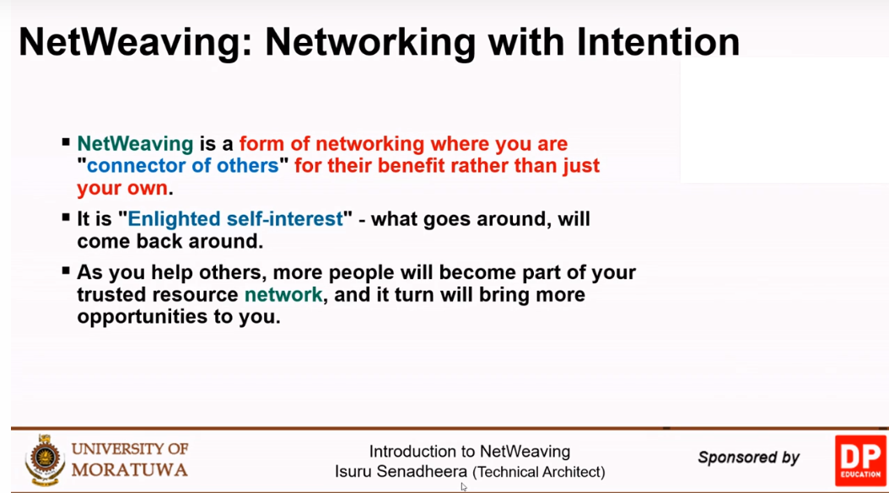

# C6A - Professional Practise in Software Development

# Questioning Culture

## Leading with questions

- Open ended/Closed ended questions
- Empowering/Disempowering questions

## Agile Culture

- Judge/Learner
- Protective/Curious

## Asking from the authority

- Challenge?
- Learn/Explore/Curious

# Answering Questions

## Why they are asking?

Learn/To show they knows/To show you don't know/etc.

## Reflect back. Show the mirror

They themselves will find the answer.

# Rookie Effect

Rookie Smarts: Why Learning Beats Knowing in the New Game of Work

# Personal Branding

- Personal vision
- The brand
- Bridges

Identify values, strengths. Setup life goals based on the values and strengths.

## Values

## Strengths

# The Creator

# Netweaving

# Open Source

https://up-for-grabs.net/

https://github.com/up-for-grabs/up-for-grabs.net

https://goodfirstissues.com/

